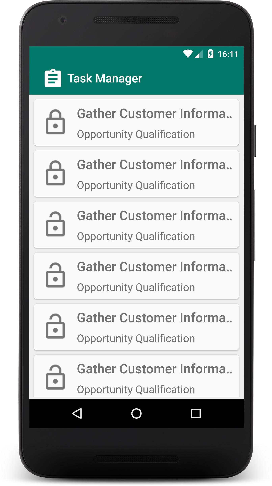
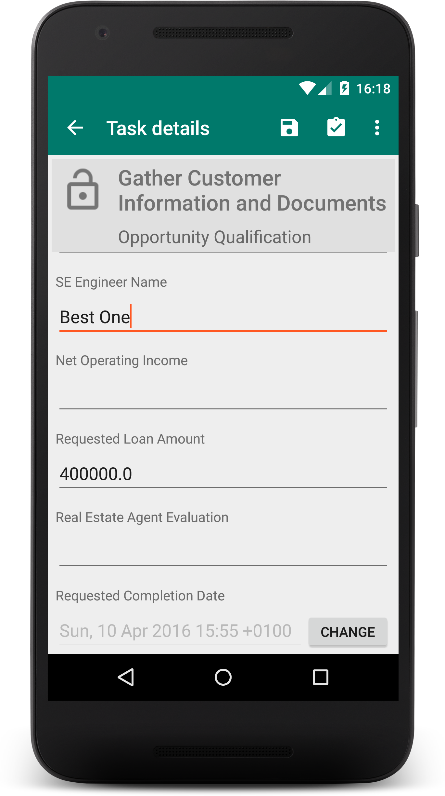
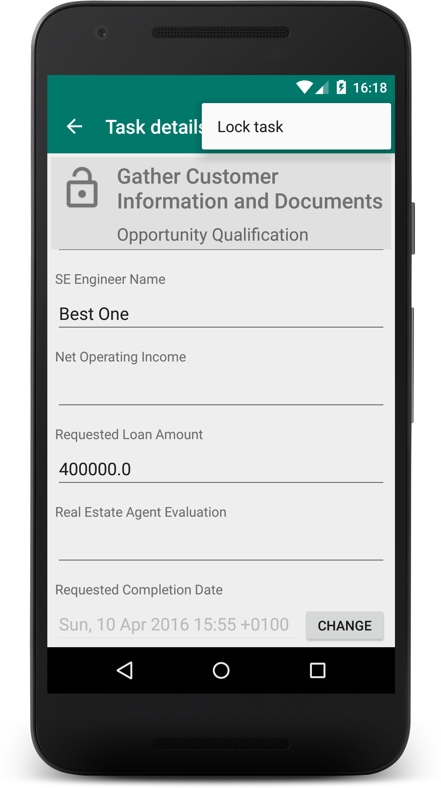
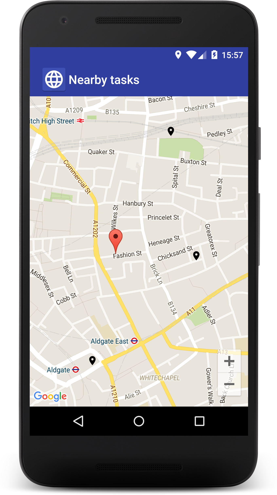
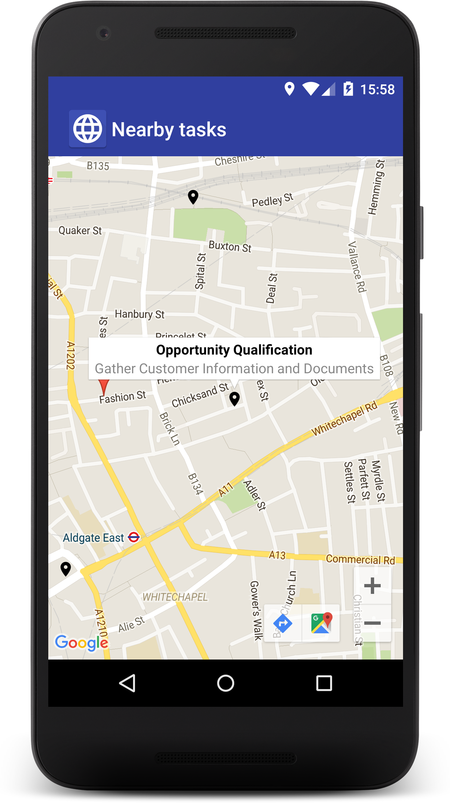
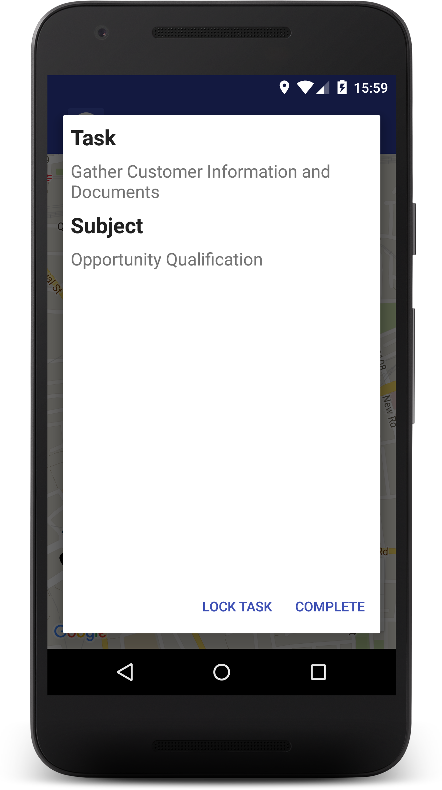

#Welcome

This document will provide you information about how to install and use the source code provided with the IBM Redpaper : "IBM Enterprise Content Management Mobile Application Implementation".

#Overview

The sample source code provided with this document is a collection of examples of what can be achieved with the adoption of the IBM ECM Mobile SDKs mentioned in the Redpaper.

The kit is composed by two sample apps for Android : the IBM Case Manager Nearby Sample and the IBM Edit Task Sample.

The IBM Case Manager Nearby Sample is intended to demonstrate the usage of the Case Manager SDK in the use case of an Inspector working remotely with his Android mobile phone. The app starts with a fullscreen map of the area around the user and shows a pin for each task located nearby.By tapping on the pin the user is able to lock or complete the task.
 
More details on how to setup the location of a task can be found in chapter 3.3.2 of the Redpaper.

The IBM Edit Task Sample allows the user to browse the tasks for a specific in-basket. 
This app models the scenario where the user is required to provide information about a task, update its properties and complete it if needed.

#Prerequisites

This document assumes the reader has a working knowledge of IBM Case Manager, the Java language and the Android platform.

#### SDK Prerequisites
Here are the prerequisites for using the SDK:

- An IBM Case Manager server that runs IBM Case Manager 5.2.1 or later
- A mobile phone running Android 4.4 KitKat 
- A computer running Android Studio version 1.5
- The IBM Case Manager Mobile SDK 1.0.0.1 or later package
- The IBM Case Manager Mobile Configurator plugin 1.0.0.1 or later installed on the server

#Package
The package contains :

- sample\_edit\_tasks : a folder containing the source code for the Case Manager Edit Task Sample app
- sample\_nearby\_tasks : a folder containing the source code for the Case Manager Nearby Sample app

#Installation
Copy the archive on the computer where Andorid Studio is installed.
From Android Studio select "Open ..." > "File" and select the folder of one of the sample.
Repete the previous step for the other sample.

## Task Manager

**Task-Manager Sample** is a simple application that shows you how to interact with the **Casemanager SDK** in order to obtain a list of the tasks, view task properties and perform actions on a task (update,lock,complete).

The app tries to demonstrate the functionality of the library in a simple way, without too much complexity.

### Screenshots

## Nearby Tasks

**Nearby-Tasks Sample** is a simple application that shows you how to interact with the **Casemanager SDK** in order to obtain a list of the tasks that are close to the user's current location.

The app tries to demonstrate the functionality of the library in a simple way, without too much complexity.

### Setup

**Before you can run the sample app you need to configure Google Maps for your project !**

Basically, you need to replace the **google-maps-key** found in ***debug/res/values/google_maps_api.xml*** file with a new key generated for your Console Project. Instructions can be found [here](https://developers.google.com/maps/documentation/android-api/start).

**If you do not replace the maps key you won't be able to see the map !**

### Screenshots

## LICENSE

[Apache License Version 2.0](../LICENSE)

